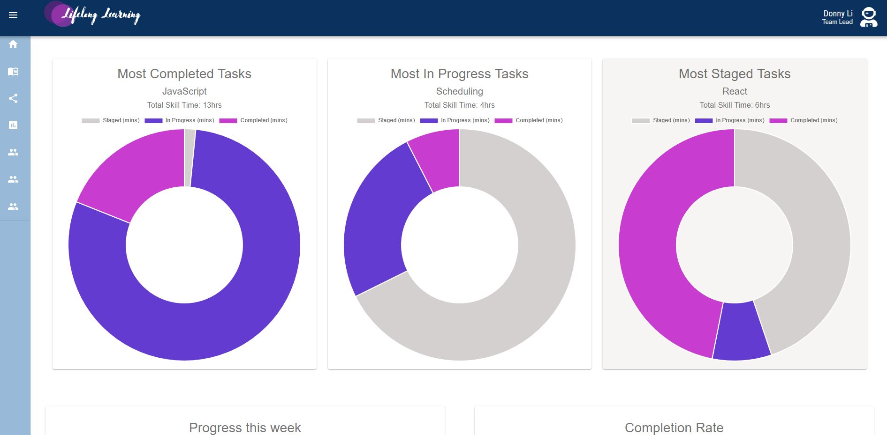
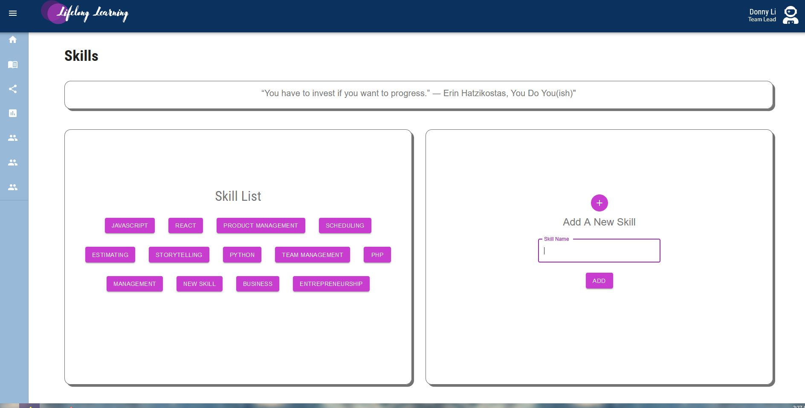
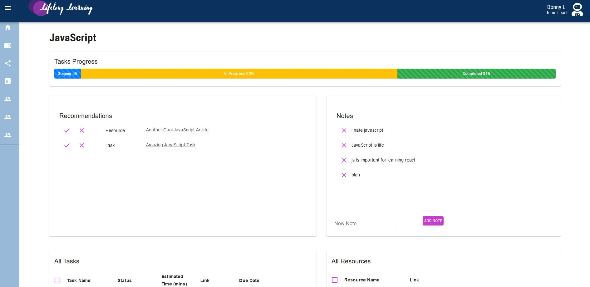

<!-- PROJECT LOGO -->
<br />
<div align="center">
  <a href="https://github.com/alvinoalvin/lifelong-learning">
    
  </a>

  <p align="center">
    Lifelong learning is a project created for then purpose of helping people keep track of their progress while developing new skills 
    <div>  
      <a href="https://github.**com**/alvinoalvin/lifelong-learning/wiki"><strong>Explore the docs »</strong></a>
    </div>
    <a href="https://github.com/alvinoalvin/lifelong-learning/issues">Report Bug</a>
    ·
    <a href="https://github.com/alvinoalvin/lifelong-learning/issues">Request Feature</a>
  </p>
</div>

<!-- TABLE OF CONTENTS -->
<details>
  <summary>Table of Contents</summary>
  <ol>
    <li>
      <a href="#about-the-project">About The Project</a>
      <ul>
        <li><a href="#built-with">Built With</a></li>
      </ul>
    </li>
    <li>
      <a href="#getting-started">Getting Started</a>
      <ul>
        <li><a href="#prerequisites">Prerequisites</a></li>
        <li><a href="#installation">Installation</a></li>
      </ul>
    </li>
    <li><a href="#usage">Usage</a></li>
    <li><a href="#roadmap">Roadmap</a></li>
    <li><a href="#contributing">Contributing</a></li>
    <li><a href="#license">License</a></li>
    <li><a href="#contact">Contact</a></li>
    <li><a href="#acknowledgments">Acknowledgments</a></li>
  </ol>
</details>

  <!-- ABOUT THE PROJECT -->

## About The Project



There are many great productivity apps that are on the web, however we wanted to create something that would allow users to track their own progress as well as make recommendations to help each others develop new skills.

<p align="right">(<a href="#readme-top">back to top</a>)</p>

### Built With

- [React.js](https://react.dev/)
- [Express.js](https://expressjs.com/)
- [Material-ui](https://mui.com/material-ui/)
- [Sass](https://sass-lang.com/)
- [Heroku](https://dashboard.heroku.com/)
- [Postgres](https://www.postgresql.org/)

<p align="right">(<a href="#readme-top">back to top</a>)</p>

<!-- GETTING STARTED -->

## Getting Started

As the site is not currently published, in order to run it we'll need to get a local copy up and running follow these simple example steps.

### Prerequisites

This is an example of how to list things you need to use the software and how to install them.

- create a database and run the create.sql script you can populate it with the development.sql script if you want test data
- create a .env file and link the database

### Installation

1. Clone the repo
   ```
   git clone https://github.com/alvinoalvin/lifelong-learning.git
   ```
2. Install NPM packages
   ```
   npm install
   cd client
   npm install
   ```

### Running the project

2. Build the project on both client and server side(root dir). You'll need a second terminal for this
   ```
   npm run build
   ```
3. Run the project on both client and server side
   ```
   npm run start
   ```
4. Navigate to localhost:3000

<p align="right">(<a href="#readme-top">back to top</a>)</p>

<!-- USAGE EXAMPLES -->

## Usage

This site allows users to keep track of their progress on new skills and to plan out their path. To start we'll go through a typical workflow!

1.  Click the book icon in the nav bar and add a skill you'd like to progress in
2.  Open up the skill in the skill list
    
3.  Here we can see a few things

    - Our task progress
    - Some recommendations that other team members have given us for our skill
    - Any notes we wrote previously
    - Some tasks we set for ourselves
    - Some resources we've taken note of

4.  from there we can now interact with whatever we need say check off a task or add a note, maybe check out a recommendation from a friend
    

<p align="right">(<a href="#readme-top">back to top</a>)</p>

<!-- LICENSE -->

## License

Distributed under the MIT License. See `LICENSE.txt` for more information.

<p align="right">(<a href="#readme-top">back to top</a>)</p>
